# 🚀 AI-Powered CRM System

## 📖 Introduction

This project is a modern full-stack CRM (Customer Relationship Management) system designed to help businesses manage leads, track customer interactions, organize sales pipelines, and monitor revenue performance through a clean and responsive dashboard.

The application allows users to securely manage customer leads from the beginning of the sales process until conversion. Users can create new leads, assign salespersons, update lead statuses, maintain lead notes, analyze revenue insights, and export lead data into Excel or CSV reports.

This CRM system is built using modern web technologies including React, Tailwind CSS, FastAPI, SQLAlchemy, and SQLite, with future-ready AI/ML integration capabilities for smart lead scoring and sales analytics.

The system follows a SaaS-style responsive UI design and provides a professional dashboard experience similar to modern enterprise CRM platforms.

---

# ⚡ How This CRM System Works

The CRM workflow is designed around lead management and sales tracking.

### 🔐 Step 1 — Create Admin

Before accessing the CRM system for the first time, an admin account must be created using the backend route:

```bash
http://127.0.0.1:8000/auth/create-admin
```

This automatically creates the default admin account.

---

### 🔑 Step 2 — Login

The admin can log into the system using:

```bash
Email: admin@example.com
Password: password123
```

After successful login, users gain access to the CRM dashboard and lead management system.

---

### 👥 Step 3 — Manage Leads

Users can:

- Add new customer leads
- Update existing lead information
- Delete leads
- Assign salespersons
- Track lead statuses
- Monitor estimated deal values

Each lead stores important business information such as:

- Customer Name
- Company Name
- Email Address
- Phone Number
- Lead Source
- Assigned Salesperson
- Deal Value
- Status Tracking

---

### 📝 Step 4 — Manage Notes

Every lead supports its own note management system.

Users can:

- Add notes
- Edit notes
- Delete notes

Each note contains:

- Note Content
- Created By
- Created Date

This helps track communication history and customer interactions.

---

### 📊 Step 5 — Dashboard Analytics

The dashboard automatically calculates:

- Total Leads
- Won Leads
- Lost Leads
- Qualified Leads
- Contacted Leads
- Revenue Pipeline
- Closed Deal Revenue
- Win/Loss Performance

This helps businesses monitor sales performance in real time.

---

### 🔍 Step 6 — Search & Filtering

The CRM supports advanced filtering by:

- Lead Status
- Lead Source
- Assigned Salesperson

It also supports searching by:

- Lead Name
- Company Name
- Email Address

---

### 📁 Step 7 — Export Reports

Users can export all lead information into:

- CSV Reports
- Excel Reports

This allows businesses to generate offline reports and analytics.

---

# 📌 Features

## ✅ Authentication System

- Admin Creation System
- Login Authentication
- Protected CRM Access
- Session-based Authentication

---

# 🔐 First Time Setup

Before logging into the CRM for the first time, create the default admin account.

Open browser:

```bash
http://127.0.0.1:8000/auth/create-admin
```

This route automatically creates the default admin user.

---

## Default Admin Credentials

### Email

```bash
admin@example.com
```

### Password

```bash
password123
```

---

# ✅ Lead Management

Users can:

- Add Leads
- Update Leads
- Delete Leads
- Search Leads
- Filter Leads
- View Lead Details
- Track Sales Progress

Each lead contains:

- Full Name
- Company Name
- Email Address
- Phone Number
- Lead Source
- Assigned Salesperson
- Status
- Estimated Deal Value
- Created Date
- Last Updated Date

---

# ✅ Lead Status Types

- New
- Contacted
- Qualified
- Proposal Sent
- Won
- Lost

---

# ✅ Lead Source Types

- Website
- Facebook
- Instagram
- Referral
- Other

---

# ✅ Lead Notes System

Each lead supports notes with:

- Note Content
- Created By
- Created Date

Users can:

- Add Notes
- Update Notes
- Delete Notes

---

# ✅ Dashboard Analytics

Dashboard includes:

- Total Leads
- New Leads
- Contacted Leads
- Qualified Leads
- Proposal Sent Leads
- Won Leads
- Lost Leads
- Total Deal Value
- Won Deal Value
- Revenue Overview
- Lead Performance Analytics

---

# ✅ Search & Filtering

Supports filtering by:

- Lead Status
- Lead Source
- Assigned Salesperson

Supports searching by:

- Lead Name
- Company Name
- Email Address

---

# ✅ Export System

Users can export lead data into:

- CSV File
- Excel File

---

# ✅ Responsive Modern UI

- Full-width dashboard layout
- Responsive CRM interface
- Quick View popup system
- Modern SaaS-style design
- Tailwind CSS styling

---

# 🧠 AI/ML Future Scope

This project architecture supports future AI integration such as:

- AI Lead Scoring
- Lead Conversion Prediction
- Revenue Forecasting
- Smart Follow-up Recommendation
- AI Sales Analytics

---

# 🛠️ Technologies Used

## Frontend

- React.js
- Tailwind CSS
- Axios
- React Router DOM
- React Icons

---

## Backend

- FastAPI
- SQLAlchemy
- Pydantic
- Uvicorn

---

## Database

- SQLite

---

# 📂 Project Structure

```bash
crm-app/
│
├── backend/
│   ├── models/
│   ├── routes/
│   ├── schemas/
│   ├── database.py
│   ├── main.py
│   └── crm.db
│
├── frontend/
│   ├── src/
│   │   ├── api/
│   │   ├── components/
│   │   ├── pages/
│   │   ├── App.jsx
│   │   └── App.css
│
├── screenshots/
│
└── README.md
```

---

# ⚙️ Installation Guide

# 1️⃣ Clone Repository

```bash
git clone https://github.com/YOUR_USERNAME/YOUR_REPOSITORY.git
```

---

# 2️⃣ Backend Setup

Navigate into backend folder:

```bash
cd crm-app/backend
```

Create virtual environment:

```bash
python -m venv venv
```

Activate environment:

## Windows CMD

```bash
venv\Scripts\activate
```

## Git Bash

```bash
source venv/Scripts/activate
```

Install backend dependencies:

```bash
pip install fastapi uvicorn sqlalchemy pydantic python-multipart pandas openpyxl
```

Run backend server:

```bash
python -m uvicorn main:app --reload
```

Backend runs at:

```bash
http://127.0.0.1:8000
```

---

# 3️⃣ Frontend Setup

Open new terminal:

```bash
cd crm-app/frontend
```

Install frontend dependencies:

```bash
npm install
```

Install React Icons:

```bash
npm install react-icons
```

Run frontend:

```bash
npm run dev
```

Frontend runs at:

```bash
http://localhost:5173
```

---

# 📊 API Endpoints

# Leads API

| Method | Endpoint | Description |
|---|---|---|
| GET | /leads | Get all leads |
| POST | /leads | Create lead |
| PUT | /leads/{id} | Update lead |
| DELETE | /leads/{id} | Delete lead |

---

# Notes API

| Method | Endpoint | Description |
|---|---|---|
| GET | /notes/{lead_id} | Get notes |
| POST | /notes | Add note |
| PUT | /notes/{note_id} | Update note |
| DELETE | /notes/{note_id} | Delete note |

---

# Export API

| Method | Endpoint | Description |
|---|---|---|
| GET | /export/csv | Download CSV |
| GET | /export/excel | Download Excel |

---

# 🖼️ SCREENSHOTS SECTION

# IMPORTANT ⚠️

Create a folder named:

```bash
screenshots
```

inside root project directory.

Example:

```bash
crm-app/screenshots/
```

---

# 📸 REQUIRED SCREENSHOTS

## 1️⃣ Login Page

### File Name:

```bash
login-page.png
```

### Screenshot Should Include:

- Login form
- Dark background
- Email field
- Password field
- Login button

---

## 2️⃣ Dashboard Overview

### File Name:

```bash
dashboard-overview.png
```

### Screenshot Should Include:

- Dashboard analytics cards
- Revenue overview
- Performance analytics
- Full-width dashboard UI

---

## 3️⃣ Leads Page

### File Name:

```bash
leads-page.png
```

### Screenshot Should Include:

- Leads table
- Search filters
- Status dropdowns
- Export buttons

---

## 4️⃣ Add Lead Form

### File Name:

```bash
add-lead-form.png
```

```bash
add-lead-form-1.png
```

### Screenshot Should Include:

- Add lead form
- Lead source dropdown
- Save button
- Status selector

---

## 5️⃣ Lead Details Popup

### File Name:

```bash
lead-details-popup.png
```

```bash
lead-details-popup1.png
```

```bash
lead-details-popup2.png
```

```bash
lead-details-popup3.png
```

### Screenshot Should Include:

- Quick View popup/modal
- Lead detail cards
- Close button
- Notes section

---

## 6️⃣ Notes System

### File Name:

```bash
lead-notes.png
```

### Screenshot Should Include:

- Add note
- Edit note
- Delete note
- Note timestamps
- Created By information

---

## 7️⃣ Export System

### File Name:

```bash
export-system.png
```

```bash
export-system2.png
```

### Screenshot Should Include:

- CSV Export
- Excel Export
- Download buttons

---

# 🖼️ ADD SCREENSHOTS HERE

After adding images into screenshots folder, add this section:

```md
## Login Page

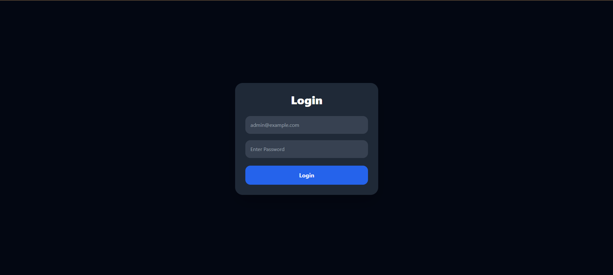

---

## Dashboard Overview

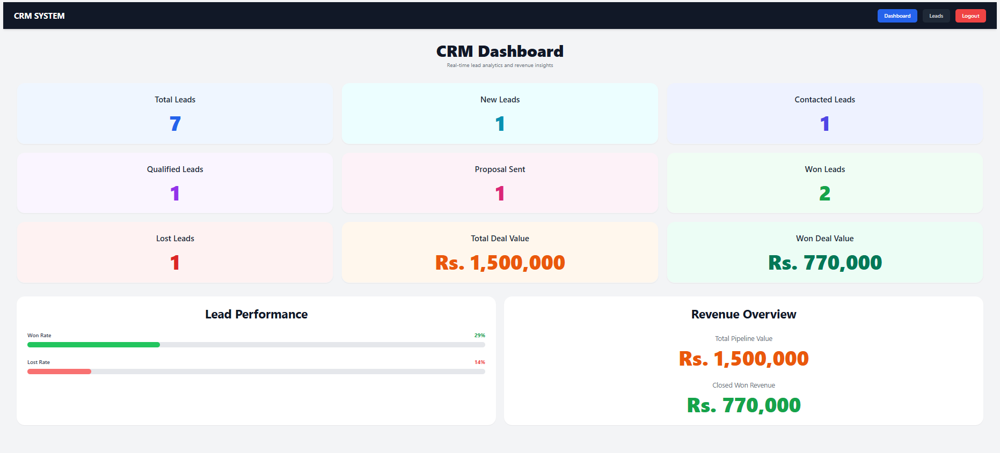

---

## Leads Management

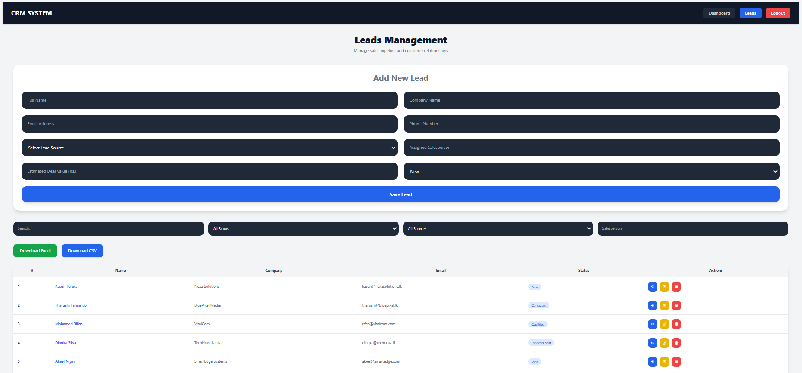

---

## Add Lead Form

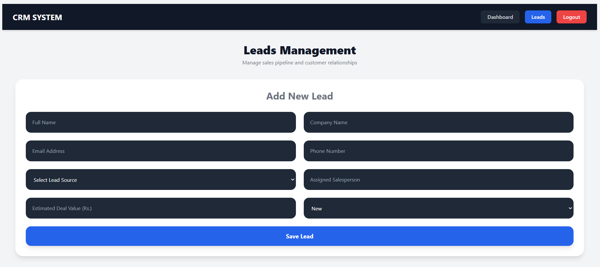


---

## Lead Details Popup

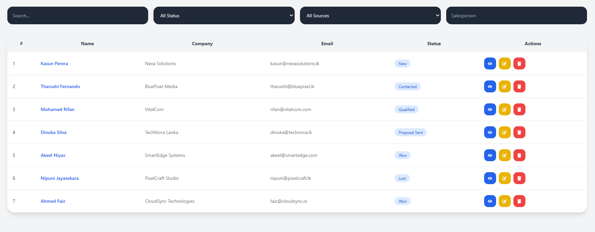

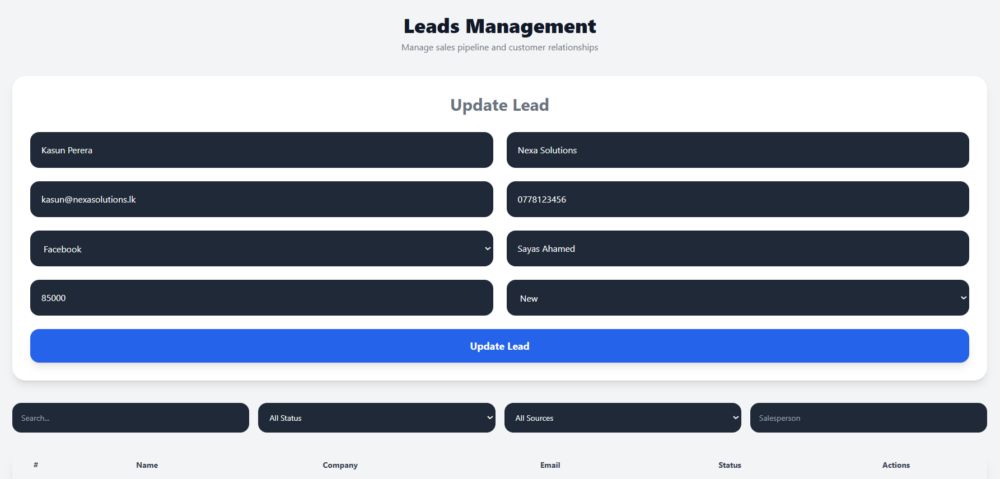

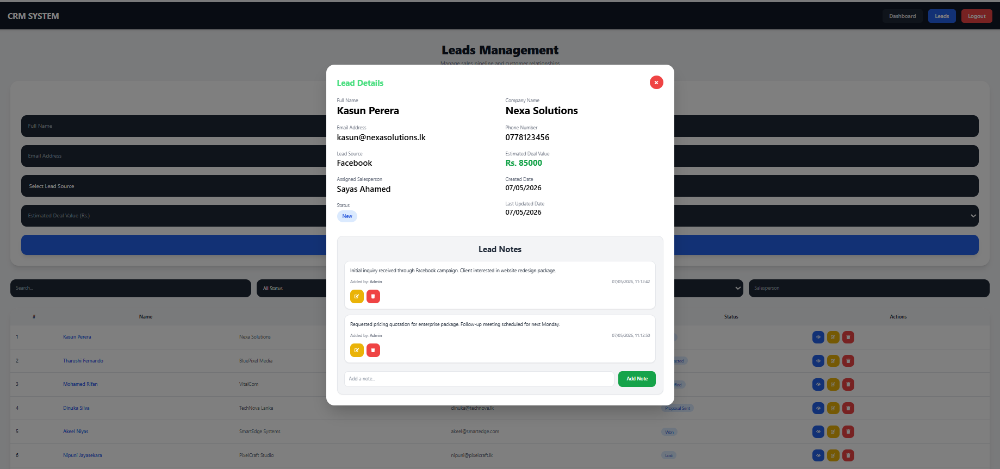

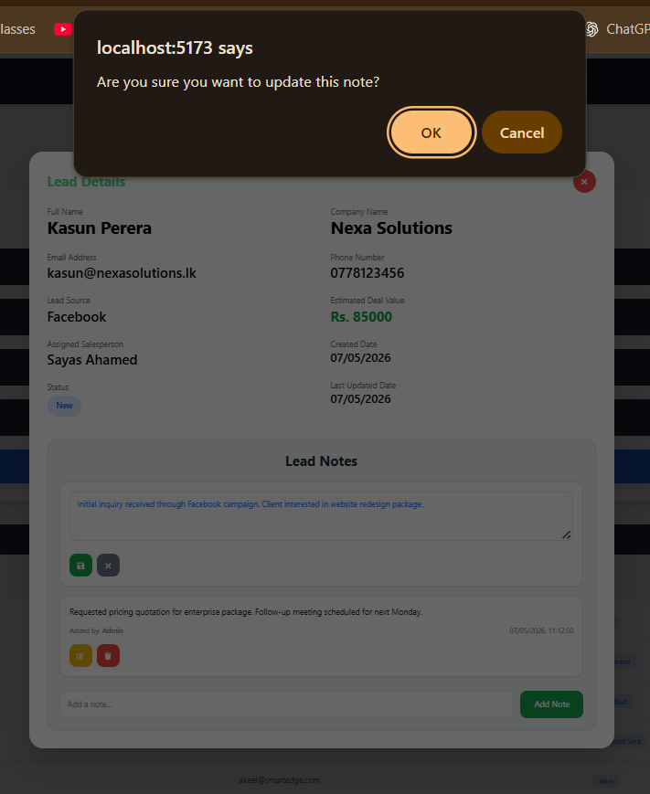

---

## Notes System

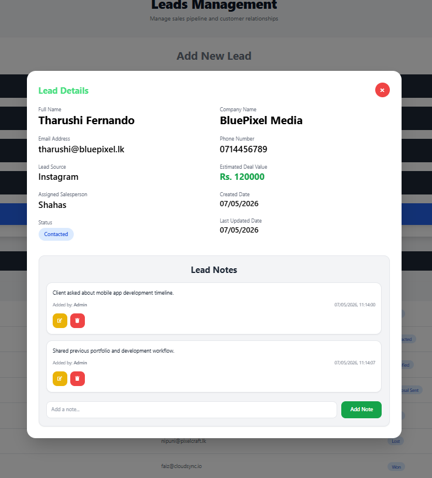

---

## Export System

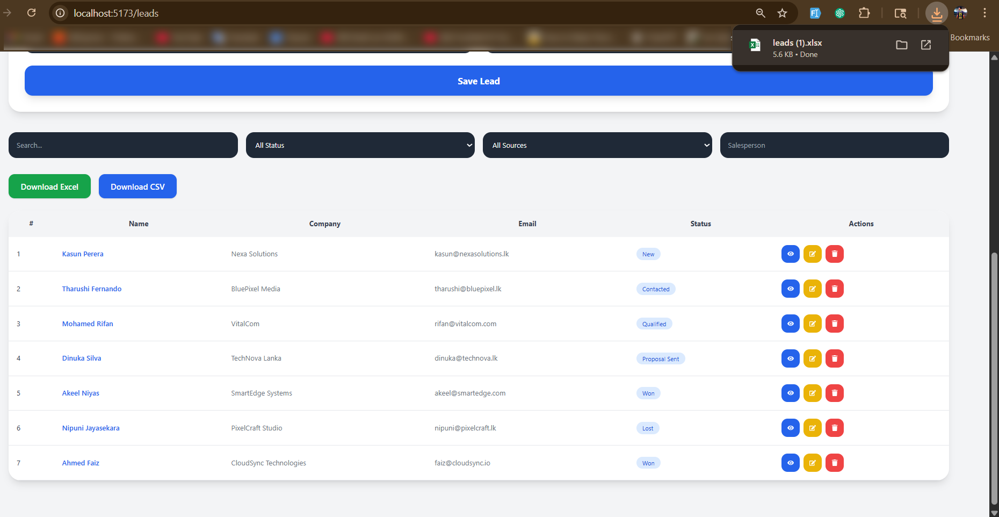

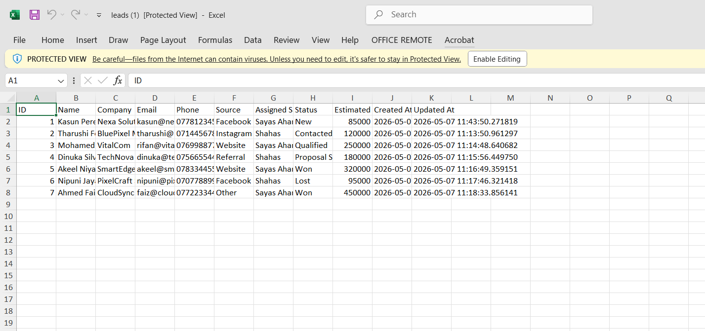
```

---

# 🚀 Future Improvements

- JWT Authentication
- AI Lead Scoring
- Email Notifications
- Revenue Forecasting
- Activity Timeline
- Team Collaboration
- Cloud Deployment
- PostgreSQL Support
- CRM Mobile Application

---

# 👨‍💻 Author

## M.M. Sayas Ahamed

- BICT Undergraduate
- Rajarata University of Sri Lanka
- Full Stack & AI/ML Developer

---

# 📄 License

This project is for educational and portfolio purposes.