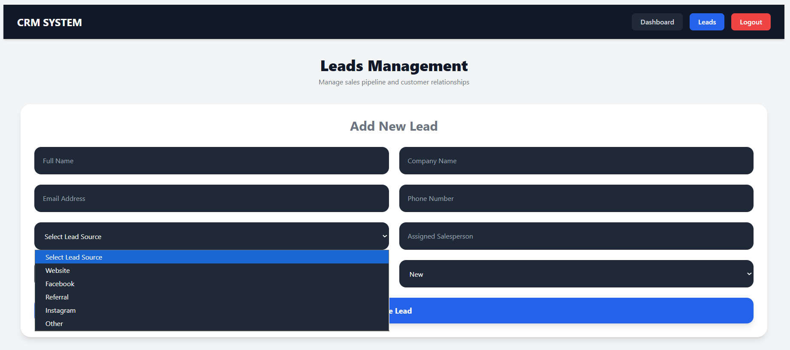

# AI-Powered CRM System

<div align="center">


### Modern Full-Stack CRM Application  
### Built with React, FastAPI, SQLite & Tailwind CSS

</div>

---

# Introduction

The AI-Powered CRM System is a modern Customer Relationship Management platform designed to help businesses manage customer leads, track sales pipelines, organize communications, and monitor revenue analytics through a professional dashboard interface.

This application provides a complete lead management workflow from customer acquisition to conversion tracking. Users can create leads, update lead statuses, assign salespersons, maintain lead notes, analyze business performance, and export reports into CSV and Excel formats.

The system is developed using modern full-stack technologies and follows a clean SaaS-style UI architecture suitable for real-world CRM environments.

---

# Core Features

## Authentication System

- Admin Account Creation
- Secure Login System
- Protected Routes
- Session-Based Access Protection
- Logout Authentication Control

---

## Lead Management

Users can:

-  Add Leads
-  Update Leads
-  Delete Leads
-  Quick View Lead Details
-  Search Leads
-  Filter Leads
-  Track Sales Status

Each lead contains:

- Full Name
- Company Name
- Email Address
- Phone Number
- Lead Source
- Assigned Salesperson
- Status
- Estimated Deal Value
- Created Date
- Updated Date

---

## Lead Notes System

Each lead includes a dedicated notes section.

### Features:

- Add Notes
- Edit Notes
- Delete Notes
- Timestamp Tracking
- Created By Tracking

Each note contains:

- Note Content
- Created By
- Created Date

---

## Dashboard Analytics

The dashboard automatically calculates:

- Total Leads
- New Leads
- Contacted Leads
- Qualified Leads
- Proposal Sent Leads
- Won Leads
- Lost Leads
- Total Revenue
- Won Revenue
- Sales Performance Metrics

---

## Export System

Export lead data into:

- CSV Reports
- Excel Reports

Useful for:

- Offline Reporting
- Data Backup
- Business Analytics
- Client Reporting

---

# AI/ML Future Scope

This project architecture supports future AI integration features such as:

- AI Lead Scoring
- Lead Conversion Prediction
- Revenue Forecasting
- Smart Follow-up Suggestions
- AI Sales Analytics
- Customer Behavior Analysis

---

# Technologies Used

## Frontend

- React.js
- Tailwind CSS
- Axios
- React Router DOM
- React Icons

---

## Backend

- FastAPI
- SQLAlchemy
- Pydantic
- Uvicorn

---

## Database

- SQLite

---

# 📂 Project Structure

```bash
crm-app/
│
├── backend/
│   ├── models/
│   ├── routes/
│   ├── schemas/
│   ├── database.py
│   ├── main.py
│   └── crm.db
│
├── frontend/
│   ├── src/
│   │   ├── api/
│   │   ├── components/
│   │   ├── pages/
│   │   ├── App.jsx
│   │   └── App.css
│
├── screenshots/
│
└── README.md
```

---

# ⚙️ Installation Guide

# 1️⃣ Clone Repository

```bash
git clone https://github.com/YOUR_USERNAME/CRM-Application.git
```

---

# 2️⃣ Backend Setup

```bash
cd crm-app/backend
```

Create virtual environment:

```bash
python -m venv venv
```

Activate environment:

## Windows CMD

```bash
venv\Scripts\activate
```

## Git Bash

```bash
source venv/Scripts/activate
```

Install dependencies:

```bash
pip install fastapi uvicorn sqlalchemy pydantic python-multipart pandas openpyxl
```

Run backend server:

```bash
python -m uvicorn main:app --reload
```

Backend URL:

```bash
http://127.0.0.1:8000
```

---

# 3️⃣ Frontend Setup

Open new terminal:

```bash
cd crm-app/frontend
```

Install packages:

```bash
npm install
```

Install icons:

```bash
npm install react-icons
```

Run frontend:

```bash
npm run dev
```

Frontend URL:

```bash
http://localhost:5173
```

---

# First Time Admin Setup

Before logging into the CRM system, create the default admin account.

Open browser:

```bash
http://127.0.0.1:8000/auth/create-admin
```

---

# Default Login Credentials

## Email

```bash
admin@example.com
```

## Password

```bash
password123
```

---

# API Endpoints

## Leads API

| Method | Endpoint | Description |
|---|---|---|
| GET | /leads | Get all leads |
| POST | /leads | Create lead |
| PUT | /leads/{id} | Update lead |
| DELETE | /leads/{id} | Delete lead |

---

## Notes API

| Method | Endpoint | Description |
|---|---|---|
| GET | /notes/{lead_id} | Get notes |
| POST | /notes | Add note |
| PUT | /notes/{note_id} | Update note |
| DELETE | /notes/{note_id} | Delete note |

---

## Export API

| Method | Endpoint | Description |
|---|---|---|
| GET | /export/csv | Download CSV |
| GET | /export/excel | Download Excel |

---

# Application Screenshots

---

# Login Page


### Includes:

- Secure Login Form
- Dark UI Theme
- Responsive Layout
- Authentication Access

---

# Dashboard Overview


### Includes:

- Real-time CRM Analytics
- Revenue Monitoring
- Lead Statistics
- Performance Overview

---

# Leads Management Page


### Includes:

- Leads Table
- Search Filters
- Status Filtering
- Export Buttons
- Quick Actions

---

# Add Lead Form




### Includes:

- Lead Creation Form
- Lead Source Selection
- Status Dropdown
- Salesperson Assignment

---

# Lead Details Popup


### Includes:

- Quick View Popup
- Customer Information
- Notes Integration
- Status Information

---

# Notes Management


### Includes:

- Add Notes
- Edit Notes
- Delete Notes
- Created By
- Date Tracking

---

# Export System


### Includes:

- CSV Export
- Excel Export
- Instant File Download

---

# Future Improvements

- JWT Authentication
- AI Lead Scoring
- Email Notifications
- Cloud Deployment
- PostgreSQL Support
- CRM Mobile App
- Team Collaboration
- Activity Timeline
- Notification System

---

# Author

## M.M. Sayas Ahamed

- BICT(Hons) Undergraduate
- Rajarata University of Sri Lanka
- Full Stack Developer
- AI/ML Enthusiast

---

# 📄 License

This project is developed for educational, portfolio, and learning purposes.